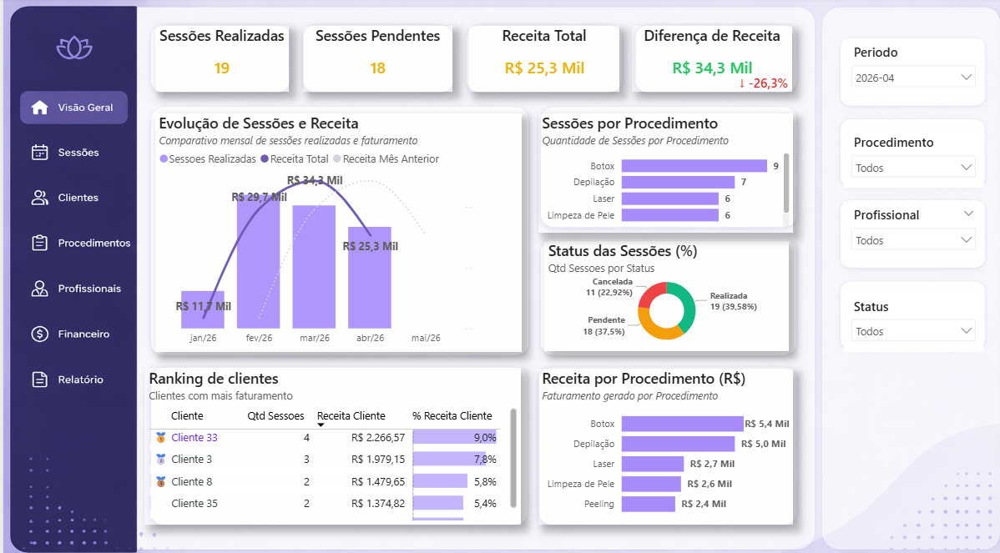
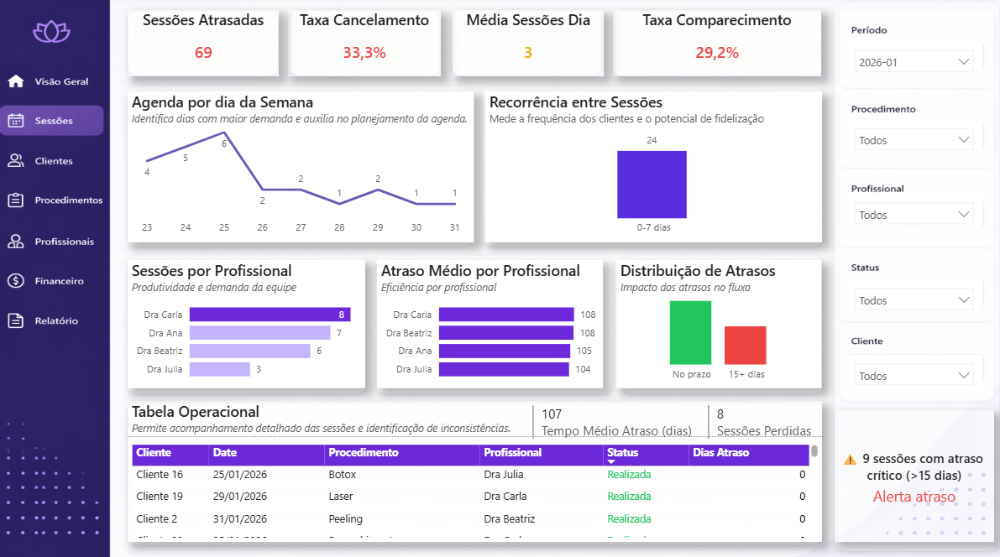
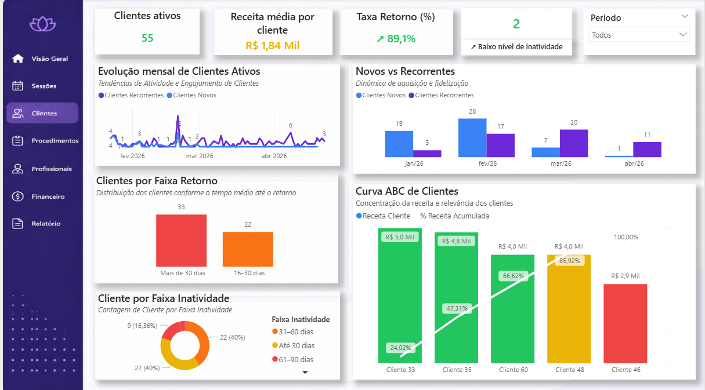
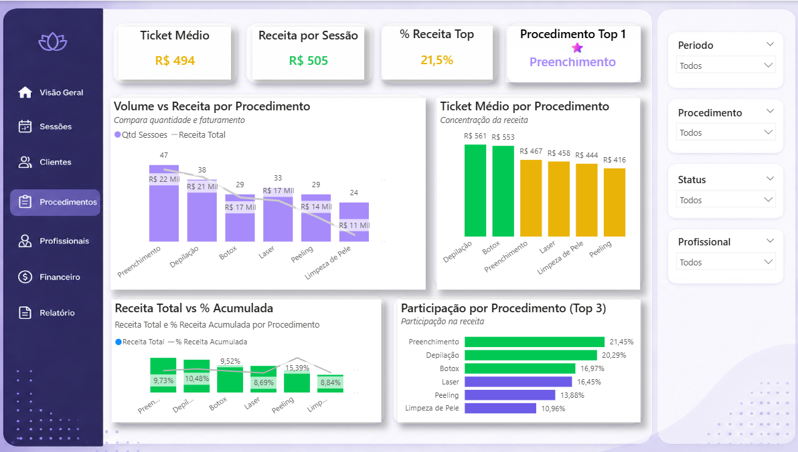
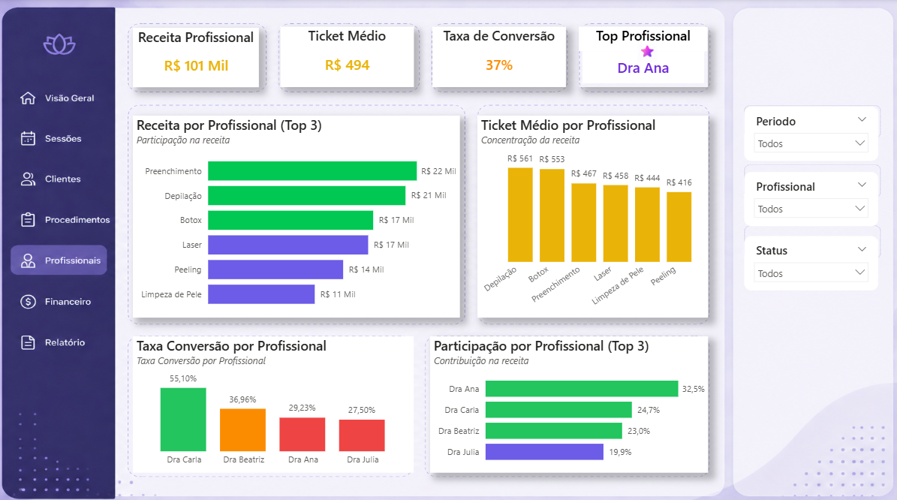
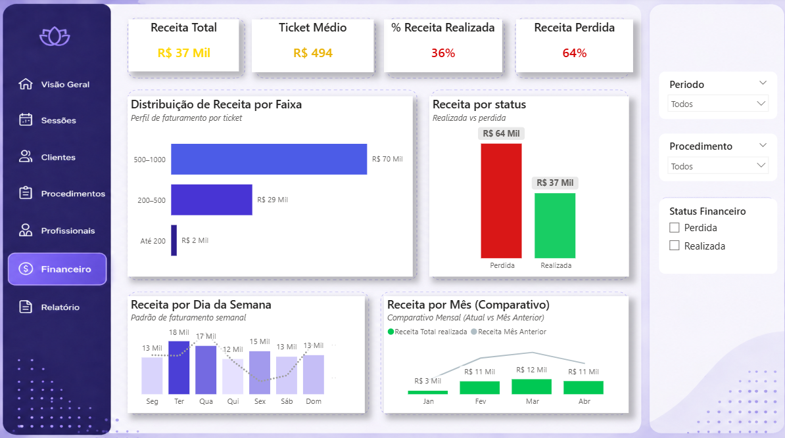

# Dashboard Clínica Estética | Power BI

Solução de Business Intelligence desenvolvida em Power BI para análise de desempenho e apoio à gestão estratégica de uma clínica estética.

O projeto foi inspirado em uma situação real observada em uma clínica que realizava o controle de sessões manualmente, utilizando papéis e registros descentralizados. A proposta foi desenvolver uma solução piloto capaz de transformar dados operacionais em informações estratégicas, facilitando o acompanhamento de indicadores e apoiando a tomada de decisão.

## 🎯 Objetivo do Projeto

Centralizar informações operacionais e financeiras em um dashboard interativo, permitindo acompanhar o desempenho da clínica, identificar padrões de comportamento dos clientes, analisar resultados e apoiar o planejamento estratégico.

## 📊 Demonstração do Dashboard

### 🏠 Visão Geral
Painel com os principais indicadores de clientes, recorrência, evolução mensal e Curva ABC.



### 📅 Sessões
Acompanhamento de sessões realizadas, pendentes, cancelamentos, atrasos, recorrência e demanda operacional.



### 👥 Clientes
Análise de clientes ativos, novos e recorrentes, faixas de retorno, inatividade e Curva ABC de clientes.



### 💆 Procedimentos
Análise de volume de sessões, receita, ticket médio, participação e desempenho dos procedimentos.



### 🩺 Profissionais
Acompanhamento da receita, ticket médio, taxa de conversão e participação por profissional.



### 💰 Financeiro
Análise da receita total, ticket médio, receitas realizadas e perdidas, distribuição por faixa e evolução mensal.



### 📈 Relatório Executivo
Visão consolidada dos indicadores, com detalhamento de receita, sessões, ticket, conversão e status de desempenho por procedimento.


## 💡 Principais Indicadores

- Receita total
- Ticket médio
- Taxa de conversão
- Receita perdida
- Retenção de clientes
- Recorrência de sessões
- Curva ABC de clientes e procedimentos
- Performance operacional
- Taxa de cancelamento
- Taxa de comparecimento
- Desempenho por profissional

## ⚙️ Funcionalidades

- Visão geral da operação
- Controle de sessões e recorrência
- Análise de clientes ativos e inativos
- Gestão financeira
- Análise de procedimentos
- Acompanhamento de indicadores de profissionais
- Filtros interativos por período, procedimento, profissional e status
- Relatórios executivos para apoio à tomada de decisão
- Navegação entre páginas e tooltips informativos

## 🛠 Tecnologias Utilizadas

- **Power BI** — desenvolvimento do dashboard e visualização de dados
- **DAX** — criação de medidas e indicadores
- **Power Query** — tratamento e transformação de dados
- **Modelagem de Dados** — organização dos dados e relacionamentos
- **UX/UI** — estrutura visual, navegação e experiência do usuário

## 🎥 Demonstração do Projeto

Vídeo demonstrando a navegação, os filtros e os indicadores do dashboard:

🔗 [Assistir demonstração no LinkedIn](https://www.linkedin.com/posts/carla-morais-aliste-962898195_powerbi-businessintelligence-dataanalytics-ugcPost-7459324033352839168-O6Re?utm_source=share&utm_medium=member_desktop&rcm=ACoAAC3fBFoBiL6R_uj0LL0pdTt2tkrz2sMuU3E)

## 📂 Estrutura do Repositório

```text
dashboard-clinica-estetica---PowerBi/
│
├── images/
│   ├── visao-geral.png
│   ├── sessoes.png
│   ├── clientes.png
│   ├── Procedimentos.png
│   ├── Profissionais.png
│   ├── Financeiro.png
│   └── Relatorio.png
│
├── Dash ClinicaEstetica.pbix
└── README.md
```

## 📌 Observação

Projeto piloto desenvolvido para fins de estudo e portfólio, com dados fictícios e sem utilização de informações reais de pacientes ou clientes.

